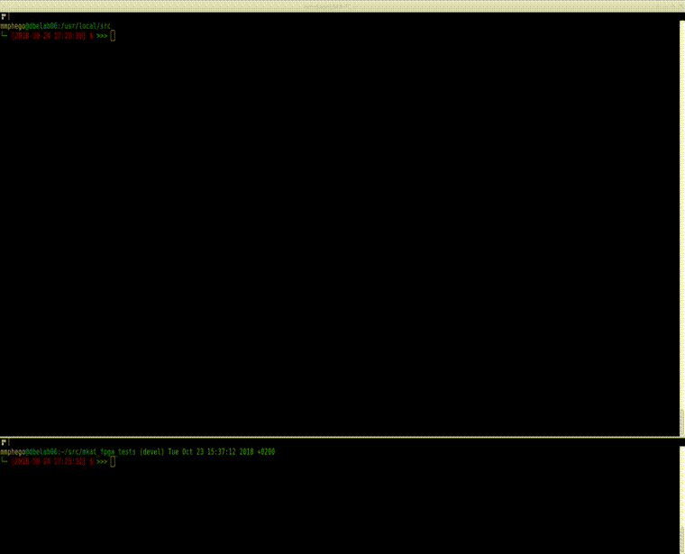

# CBF Automated Test Framework

Define a Dockerfiles that can build a docker instances useful for running Automated CBF Tests running on Jenkins CI.

The files are:
- Dockerfile
  Builds a Jenkins master-server instance. This runs the Jenkins web frontend,
  schedules builds, checks source repositories for changes, and can run certain
  jobs on slaves.
  It assumes that the jenkins user config/home directory is mounted on the container volume `/var/jenkins_home`, which should be owned by UID=2000.

- Jenkins-Swarm-Client
  Script that running as a service, for self organizing slave nodes; auto-discovers a nearbby Jenkins master and join it automatically.

  More documentation: [https://wiki.jenkins.io/display/JENKINS/Swarm+Plugin](https://wiki.jenkins.io/display/JENKINS/Swarm+Plugin)

##   Howtos

Starting from scratch, the subsection steps need to be performed in order. The
`host` referred to below is the server/VM that will be hosting the Jenkins
docker instance.

### Set up the host

1. Install [Docker](https://docs.docker.com/installation/)

    **Note:** Extra steps only needed when installing on Debian Wheezy; newer versions have per-packaged docker.io.

    Add the wheezy backports repository so that a new-enough kernel can be installed for docker:

    ```shell
    echo "deb http://http.debian.net/debian wheezy-backports main" >> /etc/apt/sources.list.d/wheezy-backports.list
    ```

    Perform the following steps in a shell
    ```shell
    sudo apt-get update
    sudo apt-get install -t wheezy-backports linux-image-amd64
    # Apparmor info: https://wiki.debian.org/AppArmor/HowToUse
    sudo apt-get install apparmor apparmor-profiles apparmor-utils
    sudo perl -pi -e \
      's,GRUB_CMDLINE_LINUX="(.*)"$,GRUB_CMDLINE_LINUX="$1 apparmor=1 security=apparmor",' /etc/default/grub
    sudo update-grub

    sudo shutdown -rf now

    sudo apt-get install apt-transport-https
    # From https://get.docker.com/ script
    sudo apt-key adv --keyserver hkp://keyserver.ubuntu.com:80 \
      --recv-keys 36A1D7869245C8950F966E92D8576A8BA88D21E9
    sudo sh -c "echo deb https://get.docker.com/ubuntu docker main \
      > /etc/apt/sources.list.d/docker.list"
    sudo apt-get update && sudo apt-get install lxc-docker
    ```

2. Fix DNS config if you use a localhost dnsmasq (like Ubuntu's using NetworkManager) by adding the *SKA SA* DNS servers to the `/etc/default/docker`


   ```shell
   DOCKER_OPTS="--dns 8.8.8.8 --dns 8.8.4.4 --dns 196.24.41.8 --dns 196.24.41.9 --dns 192.168.1.21"
   ```

   if using [dnsmasq](http://www.thekelleys.org.uk/dnsmasq/doc.html) to find the SKARABS with dnsmasq bound to the SKARABS control network interface as on the correlator controller servers, where `10.103.0.1` is the IP address of the SKARABS control network interface (usually eth2).

   ```shell
   DOCKER_OPTS="--dns 10.103.0.1"
   ```

### Deploy the Jenkins container on the host

This section is only a suggestion, there are many ways to manage docker images,
containers and volumes, but this is a simple one :)

Clone the current repository out somewhere on the host, change to the repository directory and run:

```shell
  make bootstrap
```

This will check & possibly install Java 8 JDK and Python [Fabric](http://fabfile.org/), Creates *jenkins* and *cbf-test* users for test automation, Build a Jenkins Docker container, Runs [SonarQube](sonarqube.org) and [Portainer](portainer.io).

It should be visible in the list if the `sudo docker ps` command is run.

Jenkins container will start automatically at boot-time, and it will automatically be restarted up to 10 times if it exits with an error condition.

The Jenkins web interface is exposed on port `8080` of all the host network interfaces. If you need to modify the port consult docker documentation.

The container data volume `/var/jenkins_home` will be linked to the `/home/jenkins` directory on the host. This directory should be owned by the `jenkins` user. It is recommended that it not be world readable since the jenkins configuration might contain sensitive information and it seems `Jenkins` itself is not too smart about using appropriate permissions.


**Note**: This Jenkins image exports a data volume `/var/jenkins_home` that is required to store the Jenkins configuration. This volume should be owned by a `jenkins` user with `UID 2000` (as configured in `Dockerfile`). It is recommended that the volume (if stored on the host) should not be world readable since the jenkins configuration might contain sensitive information and it seems Jenkins itself is not too smart about using appropriate permissions.

A *fabfile.py* for use with the [python Fabric](http://fabfile.org) package is included. It has tasks to set up a Jenkins/CBF-Test user with the correct UID on a host, and a task to do the git checkout.


**Note:** Edit the `CONFIG_GIT_REPO` variable to change the git repository to clone. Your host needs to have `sudo` installed, and the user used to connect to host must have `sudo` rights. Also the Python `fabric` package must be installed.

Example for setting up a Jenkins user and checking out our Jenkins configuration on a host in the home directory of the `jenkins` user, run in shell in the current repository directory:

```shell
make fabric
```

## Demo

[](https://www.youtube.com/watch?v=uK2Qlv3v6jk)

## Conclusion

Hopefully one can easily see how easy it is to set-up and run Jenkins with Docker. I’ve tried to make it as basic as possible with minimal options to take the default Jenkins container and make it a little more usable. There are other options where one can initialise Jenkins container with pre-installed plugins and etc.

By making our own Dockerfile file, we were able to make our life a little easier. We set up a convenient place to store the configuration and by running a swarm client we were able to have our artifacts and files stored in our user who is designed to run tests. We moved our default settings into the Dockerfile and now we can store this in source control as a good piece of self-documentation.

By making our own Dockerfile we have explored and achieved these concepts:

- Preserving Jenkins Job and Plugin data
- Docker Data Persistence with Volumes
- Making a Data-Volume container
- Sharing data in volumes with other containers
- Control over Jenkins and Swarm client versions, custom apt packages, Python packages and plug-in installations

Taking control of your Docker images isn’t that hard. At a minimum, paying attention to your dependencies and where they come from can help you understand what goes into making your containers work. Additionally, if you do so, you can find some opportunities to make your image lighter weight and save some disk space by removing things you don’t need to install. You also lower your risk of a dependency breaking on you.

On the other hand, you take on significant responsibility - you won’t get automatic updates and you’ll have to follow along with changes to things like the Jenkins image. Whether or not this is a benefit to you depends on your personal development policies.

Regardless of whether you choose to own your image, I do recommend that you follow the same basic practices here whenever you pick up a new Dockerfile. Find the Docker image it inherits from by using Dockerhub to help you follow the inheritance chain. Be aware of all the Dockerfiles in the chain and what they use. You should always be aware of what your images contain - after all this is stuff running on your network, on your servers. At a minimum it helps you find the base operating system but you can also learn a lot about the ecosystem of Docker images out there and learn some interesting practices.

At this point you should have a fully functional Jenkins master server image set and the basics of your own Jenkins environment.

- [Ref: How I configured JenkinsCI server in a Docker container](https://blog.mphomphego.co.za/blog/2018/10/23/How-I-configured-JenkinsCI-server-in-a-Docker-container-2.html)

### Useful Links

- [https://thepracticalsysadmin.com/setting-up-a-github-webhook-in-jenkins/](https://thepracticalsysadmin.com/setting-up-a-github-webhook-in-jenkins/)
- [https://live-rg-engineering.pantheon.io/news/putting-jenkins-docker-container](https://live-rg-engineering.pantheon.io/news/putting-jenkins-docker-container)
- [https://github.com/boxboat/jenkins-demo/blob/develop/docs/part1-jenkins-setup.md](https://github.com/boxboat/jenkins-demo/blob/develop/docs/part1-jenkins-setup.md)
- [www.donaldsimpson.co.uk/category/jenkins/page/2/](www.donaldsimpson.co.uk/category/jenkins/page/2/)


## Feedback

Feel free to fork it or send me PR to improve it.
